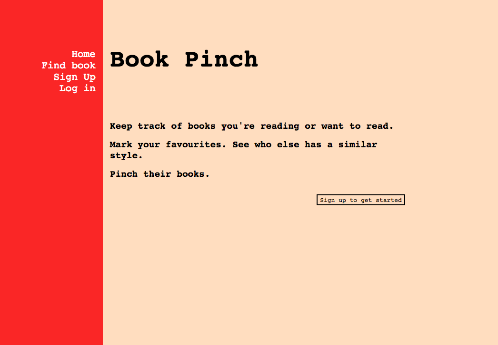

# Book Pinch

## What/why
An app to search books and track them as reading/read/to read. Create a favourites list of your highest rated books, find other users whose favourites lists contain some of the same books, and get ideas for your next book to pinch.

## Get it running
* Open it up in your browser [here]('https://bookpinch.herokuapp.com')

## Built with
* Ruby on Rails
* HTML & CSS

## Features
* Search books (using the Goodreads API)
* Sign up to add books to your book tracking collection
* For your favourites, find users who also loved the book and explore their other favourites

## Schema & Models
* Users table (a user has many readings)
* Books table (a book has many readings)
* 'Readings' table (an instance of a user (user_id) tracking a book (book_id) and info on the read status and rating) (a reading belongs to both a user and a book)

## Highlands
* Combined search via Goodreads API and search of existing Book Pinch books database
* Ability to see other users with similar book tastes

## Lowlands
* Book search is limited - only gets top hit, can only search by book title
* Not as responsiveness as I'd like
* Read status options aren't in 'select' format

## To do
- [ ] Make it responsive
- [ ] Readings model: combine three read status columns into single column
- [ ] 'All books' page to include a collection of users' favourites rather than all books
- [ ] User homepage - improve the display

## Licensing
Licensed under MIT.

## Author
Katrina Hayes, for General Assembly WDi Project1.

## Thanks to
* Joel Turnbull for helping me wrap my head around the schema and model for 'readings'
* Joel, John and Theo & my classmates at GA for support and bug fixing
* the Goodreads API
